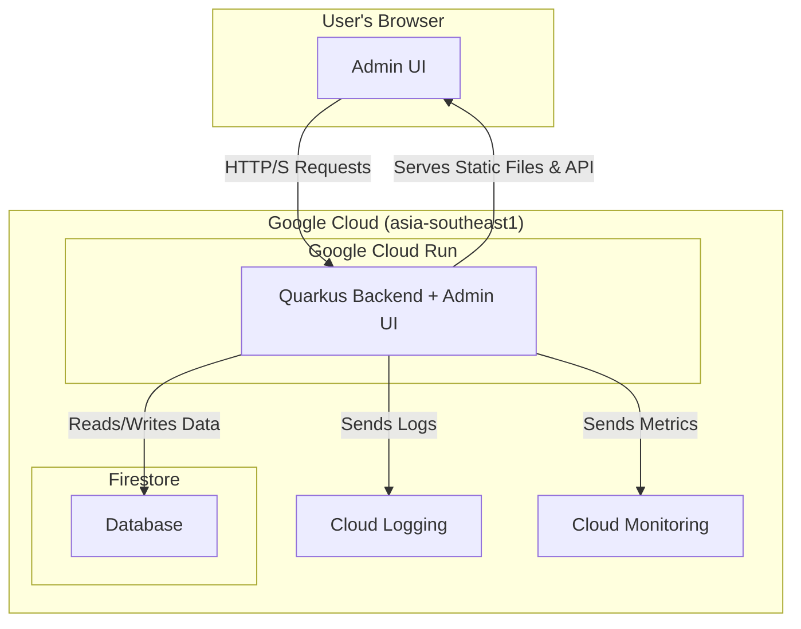
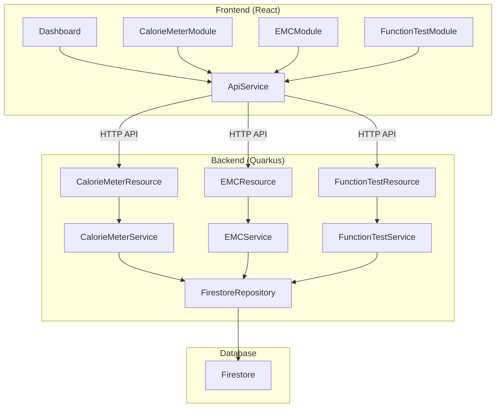
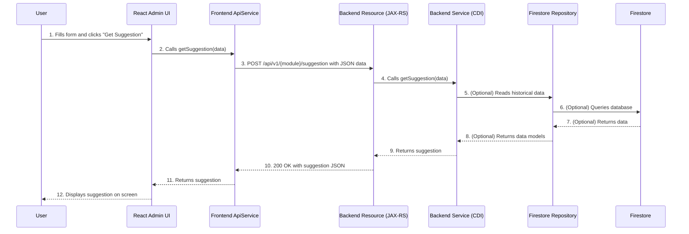
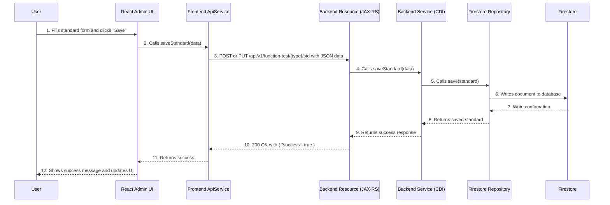

### 1. Introduction

This document outlines the complete fullstack architecture for Saijo Denki Backend for power meter, including backend systems, frontend implementation, and their integration. It serves as the single source of truth for AI-driven development, ensuring consistency across the entire technology stack.

This unified approach combines what would traditionally be separate backend and frontend architecture documents, streamlining the development process for modern fullstack applications where these concerns are increasingly intertwined.

#### 1.1. Starter Template or Existing Project

N/A - This is a greenfield project.

#### 1.2. Change Log

| Date | Version | Description | Author |
| :--- | :--- | :--- | :--- |
| | | | |

### 2. High Level Architecture (Revised)

#### 2.1. Technical Summary

The proposed architecture for the Saijo Denki power meter system is a full-stack application deployed as a single, cohesive unit on Google Cloud Run. The backend will be built with Quarkus, providing a REST API for data operations, while the frontend will be a responsive React application for administration and data visualization. The React application will be served as static assets directly by the Quarkus backend, which also handles all communication with the Firestore database. This streamlined, serverless approach is designed to meet the PRD's goals for a unified, maintainable, and scalable platform.

#### 2.2. Platform and Infrastructure Choice

**Platform:** Google Cloud
**Key Services:** Google Cloud Run, Firestore, Google Cloud Logging, Google Cloud Monitoring
**Deployment Host and Regions:** `asia-southeast1` (Bangkok)

#### 2.3. Repository Structure

**Structure:** Standard Quarkus Project
**Frontend Location:** The React application will be located in the `src/main/frontend` directory within the Quarkus project.

#### 2.4. High Level Architecture Diagram



#### 2.5. Architectural Patterns

* **Serverless Architecture:** We will use Google Cloud Run to deploy the application in a serverless manner.
  * *Rationale:* This aligns with NFR1 and NFR5, providing automatic scaling, reducing infrastructure management overhead, and allowing us to pay only for what we use.
* **Component-Based UI:** The React frontend will be built using reusable components.
  * *Rationale:* This promotes maintainability, reusability, and a consistent user experience, as outlined in the front-end specification.
* **Repository Pattern:** The Quarkus backend will use the repository pattern to abstract data access logic from the Firestore database.
  * *Rationale:* This decouples the business logic from the data store, making the application easier to test, maintain, and potentially migrate to a different database in the future.

### 3. Tech Stack

#### 3.1. Technology Stack Table

| Category | Technology | Version | Purpose | Rationale |
| :--- | :--- | :--- | :--- | :--- |
| Frontend Language | TypeScript | latest | Language for frontend development | Provides type safety and better developer experience for large applications. |
| Frontend Framework | React | latest | Core framework for the admin UI | Required by NFR3. |
| UI Component Library | Material-UI (MUI) | latest | Provides pre-built UI components | Recommended in the front-end spec for a consistent and high-quality look and feel. |
| State Management | React Context API | latest | For managing global state in React | Simple, built-in solution for state management. Can be replaced with a more robust solution like Redux if needed in the future. |
| Backend Language | Java | 17 | Language for backend development | Quarkus is a Java-based framework. |
| Backend Framework | Quarkus | latest | Core framework for the backend | Required by NFR2. |
| API Style | REST | | For communication between frontend and backend | Standard, well-understood, and implied by the PRD's API endpoint structure. |
| Database | Firestore | | Primary data store | Required by FR2. |
| Cache | None initially | | | Not required by the PRD. Can be added later if performance issues arise. |
| File Storage | Firestore | | For storing any files | Firestore can store small files. Can be migrated to Google Cloud Storage if larger files are needed. |
| Authentication | None initially | | | The PRD states that the admin UI will not have a login system in this version. |
| Frontend Testing | Jest & React Testing Library | latest | For unit and component testing of the frontend | Standard and widely used testing libraries for React applications. |
| Backend Testing | JUnit & REST Assured | latest | For unit and integration testing of the backend | Standard testing libraries for Quarkus applications. |
| E2E Testing | Cypress | latest | For end-to-end testing of the application | Popular and easy-to-use tool for E2E testing. |
| Build Tool | Vite (frontend), Maven (backend) | latest | For building and bundling the application | Vite is a modern and fast build tool for frontend development. Maven is the standard for Quarkus. |
| Bundler | Vite | latest | For bundling the frontend application | Comes with Vite. |
| IaC Tool | Google Cloud CLI scripts | | For infrastructure as code | Simple and effective for a single Google Cloud Run instance. |
| CI/CD | None | | | Deployment will be done manually from the CLI. |
| Monitoring | Google Cloud Monitoring | | For monitoring the application | Required by the operational requirements in the PRD. |
| Logging | Google Cloud Logging | | For logging application events | Required by the operational requirements in the PRD. |
| CSS Framework | MUI's built-in styling (Emotion) | | For styling the application | Comes with MUI and provides a powerful and flexible way to style components. |

### 4. Data Models

#### 4.1. AirConditionerDetails

**Purpose:** This model stores the detailed specifications of an air conditioner unit being tested in the Calorie Meter Room.

**TypeScript Interface:**

```typescript
interface AirConditionerDetails {
  model_name: string;
  serial_number: string;
  ac_type: 'Fix' | 'Inverter';
  cooling_capacity_btu_h: number;
  efficiency: number;
  fin_type: string;
  fin_option: string;
  fin_count: number;
  fin_material: string;
  refrigerant_pipe_material: string;
  refrigerant_pipe_size: string;
  evaporator_rows: number;
  evaporator_cross_section_area: number;
  fan_motor_type: string;
  fan_rpm: number;
  fan_cfm: number;
  refrigerant_type: string;
  refrigerant_volume_g: number;
  captube_inner_diameter_mm: number;
  captube_length_inch: number;
  exv_size_mm: number;
  exv_position: number;
  exv_model: string;
  txv_size_mm: number;
  txv_position: number;
  compressor_type: 'Fix' | 'Inverter';
  compressor_rpm: number;
  compressor_model: string;
  condenser_fin_type: string;
  condenser_fin_count: number;
  condenser_fin_material: string;
  condenser_refrigerant_pipe_material: string;
  condenser_refrigerant_pipe_size: string;
  condenser_rows: number;
  condenser_cross_section_area: number;
}
```

**Relationships:**

* This model is used in conjunction with the `TestResults` model for the Calorie Meter Room suggestion API.

#### 4.2. TestResults

**Purpose:** This model stores the results of a test performed in the Calorie Meter Room.

**TypeScript Interface:**

```typescript
interface TestResults {
  indoor_room_temp_dry_bulb_c: number;
  indoor_room_temp_wet_bulb_c: number;
  outdoor_room_temp_dry_bulb_c: number;
  outdoor_room_temp_wet_bulb_c: number;
  total_capacity_btu_h: number;
  sensible_heat_capacity_btu_h: number;
  latent_heat_capacity_btu_h: number;
  unit_power_input_w: number;
  unit_supply_voltage_v: number;
  unit_current_a: number;
  unit_power_factor: number;
  efficiency_eer: number;
  evaporator_inlet_temp_c: number;
  evaporator_outlet_temp_c: number;
  compressor_suction_temp_c: number;
  compressor_shell_temp_c: number;
  compressor_discharge_temp_c: number;
  condenser_mid_temp_c: number;
  condenser_outlet_temp_c: number;
  liquid_low_temp_c: number;
  compressor_suction_pressure_psi: number;
  compressor_discharge_pressure_psi: number;
  indoor_air_supply_temp_c: number;
  outdoor_air_supply_temp_c: number;
}
```

**Relationships:**

* This model is used in conjunction with the `AirConditionerDetails` model for the Calorie Meter Room suggestion API.

#### 4.3. EMCDetails

**Purpose:** This model stores the details of the EMC (Electromagnetic Compatibility) configuration for a tested unit.

**TypeScript Interface:**

```typescript
interface EmiFilter {
  l1_uh: number;
  cx1_uf: number;
  cx2_uf: number;
  cy1_uf: number;
  cy2_uf: number;
}

interface FerriteCorePosition {
  name: string;
  material: string;
  diameter: number;
  thickness: number;
  length: number;
  number_of_turns: number;
}

interface EMCDetails {
  indoor_emi_filter: EmiFilter;
  outdoor_emi_filter: EmiFilter;
  ferrite_core_positions: FerriteCorePosition[];
}
```

**Relationships:**

* This model is used in conjunction with the `EMCTestResult` model for the EMC suggestion API.

#### 4.4. EMCTestResult

**Purpose:** This model stores the results of an EMC (Electromagnetic Compatibility) test.

**TypeScript Interface:**

```typescript
interface EMCTestResult {
  test_standard: string;
  measuring_point: string;
  phase: string;
  test_result_file: string; // URL to the test result file
}
```

**Relationships:**

* This model is used in conjunction with the `EMCDetails` model for the EMC suggestion API.

#### 4.5. IndoorUnitData

**Purpose:** This model stores the test data collected from an indoor unit in the Function Test module.

**TypeScript Interface:**

```typescript
interface IndoorUnitData {
  tester_no: string;
  serial_number: string;
  item: string;
  model: string;
  timestamp: string; // ISO 8601 format
  voltage_l1_v: number;
  voltage_l2_v: number;
  voltage_l3_v: number;
  current_l1_a: number;
  current_l2_a: number;
  current_l3_a: number;
  power_kw: number;
  power_factor: number;
  error_code: string;
  room_temp_c: number;
  evap_inlet_temp_c: number;
  evap_outlet_temp_c: number;
  room_humidity_percent: number;
  pm25_ug_m3: number;
  co2_ppm: number;
  wifi_status: 'Connected' | 'Loss';
}
```

**Relationships:**

* This model is used for various API endpoints in the Function Test module. It can be associated with an `IndoorUnitStd` model for comparison.

#### 4.6. OutdoorUnitData

**Purpose:** This model stores the test data collected from an outdoor unit in the Function Test module.

**TypeScript Interface:**

```typescript
interface OutdoorUnitData {
  tester_no: string;
  serial_number: string;
  item: string;
  model: string;
  timestamp: string; // ISO 8601 format
  voltage_l1_v: number;
  voltage_l2_v: number;
  voltage_l3_v: number;
  current_l1_a: number;
  current_l2_a: number;
  current_l3_a: number;
  power_kw: number;
  power_factor: number;
  error_code: string;
  pressure_1_psi: number;
  pressure_2_psi: number;
  temp_1_c: number;
  temp_2_c: number;
  temp_3_c: number;
  temp_4_c: number;
  operation_mode: string;
  running_percent: number;
  compressor_speed_rps: number;
  voltage_dc_v: number;
  discharge_temp_c: number;
  condenser_temp_c: number;
  suction_temp_c: number;
  ambient_temp_c: number;
  outdoor_fan_speed_rpm: number;
  fresh_air_supply_temp_c: number;
  fresh_air_supply_humidity_percent: number;
  ec_fan_speed_hz: number;
  fresh_air_evap_inlet_temp_c: number;
}
```

**Relationships:**

* This model is used for various API endpoints in the Function Test module. It can be associated with an `OutdoorUnitStd` model for comparison.

### 5. API Specification

#### 5.1. REST API Specification (OpenAPI 3.0)

```yaml
openapi: 3.0.0
info:
  title: Saijo Denki Smart Factory API
  version: "1.0.0"
  description: API for the Saijo Denki Smart Factory backend, covering the Calorie Meter Room, EMC, and Function Test modules.
servers:
  - url: /api/v1
    description: API base path

paths:
  /calorie-meter/suggestion:
    post:
      summary: Get a suggestion for the Calorie Meter Room
      requestBody:
        required: true
        content:
          application/json:
            schema:
              type: object
              properties:
                air_conditioner_details:
                  $ref: '#/components/schemas/AirConditionerDetails'
                test_results:
                  $ref: '#/components/schemas/TestResults'
      responses:
        '200':
          description: Successful response
          content:
            application/json:
              schema:
                type: object
                properties:
                  response_area:
                    type: string
  /emc/suggestion:
    post:
      summary: Get a suggestion for the EMC module
      requestBody:
        required: true
        content:
          application/json:
            schema:
              type: object
              properties:
                emc_details:
                  $ref: '#/components/schemas/EMCDetails'
                emc_test_result:
                  $ref: '#/components/schemas/EMCTestResult'
      responses:
        '200':
          description: Successful response
          content:
            application/json:
              schema:
                type: object
                properties:
                  suggestion:
                    type: string
  /function-test/indoor/model:
    get:
      summary: Get indoor unit model by serial number and item
      parameters:
        - name: serial
          in: query
          required: true
          schema:
            type: string
        - name: item
          in: query
          required: true
          schema:
            type: string
      responses:
        '200':
          description: Successful response
          content:
            application/json:
              schema:
                $ref: '#/components/schemas/IndoorUnitData'
  /function-test/outdoor/model:
    get:
      summary: Get outdoor unit model by serial number and item
      parameters:
        - name: serial
          in: query
          required: true
          schema:
            type: string
        - name: item
          in: query
          required: true
          schema:
            type: string
      responses:
        '200':
          description: Successful response
          content:
            application/json:
              schema:
                $ref: '#/components/schemas/OutdoorUnitData'

components:
  schemas:
    AirConditionerDetails:
      type: object
    TestResults:
      type: object
    EMCDetails:
      type: object
    EMCTestResult:
      type: object
    IndoorUnitData:
      type: object
    OutdoorUnitData:
      type: object
```

### 6. Components

#### 6.1. Component List

**Frontend Components**

* **Dashboard**
* **CalorieMeterModule**
* **EMCModule**
* **FunctionTestModule**
* **ApiService**

**Backend Components**

* **CalorieMeterResource**
* **EMCResource**
* **FunctionTestResource**
* **CalorieMeterService**
* **EMCService**
* **FunctionTestService**
* **FirestoreRepository**

#### 6.2. Component Diagram



### 7. External APIs

N/A - This project does not require integration with any external APIs.

### 8. Core Workflows

#### 8.1. Get Suggestion Workflow (Calorie Meter / EMC)



#### 8.2. Manage Function Test Standards Workflow (Create/Update)



### 9. Database Schema

#### 9.1. `calorie_meter_tests` collection

#### 9.2. `emc_tests` collection

#### 9.3. `indoor_unit_data` collection

#### 9.4. `outdoor_unit_data` collection

#### 9.5. `indoor_unit_standards` collection

#### 9.6. `outdoor_unit_standards` collection

### 10. Frontend Architecture

#### 10.1. Component Architecture

#### 10.2. State Management Architecture

#### 10.3. Routing Architecture

#### 10.4. Frontend Services Layer

### 11. Backend Architecture

#### 11.1. Service Architecture

#### 11.2. Database Architecture

#### 11.3. Authentication and Authorization

### 12. Unified Project Structure (Revised)

```
saijo-backend/
├── .github/
├── docs/
│   ├── prd.md
│   ├── front-end-spec.md
│   └── architecture.md
├── src/
│   └── main/
│       ├── java/
│       │   └── com/
│       │       └── saijo/
│       ├── frontend/
│       │   ├── public/
│       │   ├── src/
│       │   └── package.json
│       └── resources/
│           └── META-INF/
│               └── resources/
└── pom.xml
```

### 13. Development Workflow (Revised)

#### 13.1. Local Development Setup

#### 13.2. Environment Configuration

### 14. Deployment Architecture (Revised)

#### 14.1. Deployment Strategy

#### 14.2. CLI Deployment Instructions

#### 14.3. Environments

### 15. Security and Performance

#### 15.1. Security Requirements

#### 15.2. Performance Optimization

### 16. Testing Strategy

### 17. Coding Standards

### 18. Error Handling Strategy

### 19. Monitoring and Observability

### 20. Checklist Results Report

<!-- Powered by BMAD™ Core -->
# 21. Rollback and Recovery Strategy

## 1. Guiding Principles

- **Speed over Diagnosis:** The immediate priority during a production failure is to restore service, not to debug the issue in real-time.
- **Immutable Deployments:** Each deployment creates an immutable, versioned revision in Google Cloud Run. We do not patch live services; we deploy a new, corrected version or roll back to a previous stable one.
- **Proactive Mitigation:** The best recovery is avoiding the need for one. Feature flags should be used for significant changes to allow for instant disabling withouta full rollback.

## 2. Rollback Triggers

A rollback should be initiated if automated monitoring or manual checks reveal any of the following within 15 minutes of a new deployment:

- **Health Check Failures:** The `/api/v1/health` endpoint fails consistently.
- **Increased 5xx Error Rate:** A sustained spike (e.g., >5% of requests) in server-side errors (500, 502, 503, 504) as reported by Google Cloud Monitoring.
- **Critical Functionality Failure:** A core user journey is confirmed to be broken (e.g., data submission, standards management).
- **Performance Degradation:** A significant increase (>50%) in API latency for key endpoints.

## 3. Google Cloud Run Rollback Procedure

Google Cloud Run retains previous revisions, making rollbacks a matter of redirecting traffic.

**Step 1: Identify the Stable Revision**

List the recent revisions for the service to find the last known good version.

```bash
# Replace {SERVICE_NAME} and {REGION} with appropriate values
gcloud run revisions list --service={SERVICE_NAME} --region={REGION} --format="table(revisionName,creationTime,traffic_split)"
```

**Step 2: Immediately Shift 100% of Traffic to the Stable Revision**

This is the fastest way to restore service.

```bash
# Replace {SERVICE_NAME}, {STABLE_REVISION_NAME}, and {REGION}
gcloud run services update-traffic {SERVICE_NAME} --to-revisions={STABLE_REVISION_NAME}=100 --region={REGION}
```
This command instantly diverts all users to the previous stable version. The faulty revision receives no traffic but is kept for later analysis.

**Step 3: Tag the Stable Revision (Optional but Recommended)**

To make future rollbacks easier, you can tag a revision as `stable`.

```bash
gcloud run revisions update {STABLE_REVISION_NAME} --add-tag=stable --region={REGION}
```

## 4. Post-Rollback Process

1.  **Create Post-Mortem:** A new incident report must be created to document the failure and the recovery process.
2.  **Analyze Failed Revision:** The faulty revision should be investigated in a non-production environment to identify the root cause.
3.  **Block Promotion:** The commit that caused the faulty deployment must be reverted or fixed before any new deployments can proceed.

## 5. Proactive Mitigation: Feature Flags

For high-risk changes, a full rollback should be the last resort. Instead, changes should be wrapped in feature flags.

- **Mechanism:** Use a configuration-based feature flag system (e.g., Firestore-based configuration that the application reads at startup).
- **Benefit:** If a new feature causes issues, it can be disabled instantly by changing a configuration value and restarting the service, without needing a full deployment rollback. This is much faster and less disruptive.

<!-- Powered by BMAD™ Core -->
# 22. Database Migration Strategy

## 1. Guiding Principles

- **Automated & Repeatable:** All schema and data migrations must be executed via automated scripts. Manual changes to the production database are strictly forbidden.
- **Backward Compatibility:** Migrations must be backward-compatible. The application should be able to handle data in both the old and new formats during a transition period, which is critical for zero-downtime deployments.
- **Idempotency:** Migration scripts must be idempotent, meaning they can be run multiple times without changing the result beyond the initial application.
- **Tracked & Versioned:** Every migration script is versioned, and its execution status is tracked in the database.

## 2. Migration Process

We will use a simple, script-based migration approach managed within our existing CI/CD pipeline.

**Step 1: Create a Migration Script**

- Migrations will be stored in a new top-level directory: `/migrations`.
- Scripts will be named with a version and descriptive title, e.g., `migrations/v1_001_add_creation_timestamp_to_standards.js`.
- Each script will be a Node.js script that uses the Firebase Admin SDK.

**Step 2: Track Executed Migrations**

- A dedicated Firestore collection named `_bmad_db_migrations` will be used to track which scripts have been executed.
- Before running a script, the migration runner will check if a document with the script's version ID already exists in this collection. If it does, the script is skipped.
- After a script runs successfully, its version ID is added to the collection.

**Step 3: Integrate into CI/CD**

- A new step will be added to the `cloudbuild.yaml` file.
- This step will run **before** the `gcloud run deploy` step.
- It will execute a runner script (e.g., `run-migrations.js`) that iterates through the `/migrations` directory, checks the `_bmad_db_migrations` collection, and runs any new scripts in order.

### Example `cloudbuild.yaml` modification:

```yaml
steps:
  # ... previous build steps (npm build, mvn package, docker build) ...

  # NEW STEP: Run database migrations
  - name: 'node:18-alpine'
    entrypoint: 'node'
    args: ['run-migrations.js']
    env:
      - 'GOOGLE_APPLICATION_CREDENTIALS=/workspace/firebase-service-account.json' # Ensure credentials are available

  # Deploy to Cloud Run (only after successful migration)
  - name: 'gcr.io/cloud-builders/gcloud'
    args:
      - 'run'
      - 'deploy'
      # ... rest of deployment config
```

## 3. Writing Migration Scripts

- **Schema Changes:** For adding fields, the script should query all documents in a collection and add the new field with a default value.
- **Data Changes:** For transforming data, the script should read documents, apply the transformation, and write them back.
- **Error Handling:** Each script must include robust error handling and logging.

### Example Migration Script (`v1_001_...`):

```javascript
const { initializeApp, cert } = require('firebase-admin/app');
const { getFirestore } = require('firebase-admin/firestore');

// ... (Initialization code for Firebase Admin SDK)

async function migrate() {
  const db = getFirestore();
  const standardsRef = db.collection('indoorUnitStandards');
  const snapshot = await standardsRef.where('createdAt', '==', null).get();

  if (snapshot.empty) {
    console.log('No documents to migrate.');
    return;
  }

  const batch = db.batch();
  snapshot.forEach(doc => {
    batch.update(doc.ref, { createdAt: new Date() });
  });

  await batch.commit();
  console.log(`Migrated ${snapshot.size} documents.`);
}

migrate().catch(console.error);
```

## 4. Rollback Strategy for Migrations

- **Schema Changes:** The primary strategy is **forward compatibility**. The application code deployed should be able to handle both the pre-migration and post-migration data structure gracefully. For example, when reading a document, the code should check for the presence of the new field and handle its absence.
- **Data Changes:** For destructive data changes, a **compensating script** should be written. For example, if `v1_002_rename_field_foo_to_bar.js` is created, a corresponding `v1_002_rollback_rename_bar_to_foo.js` should also be created. Rolling back would involve running the compensating script manually in a controlled environment.