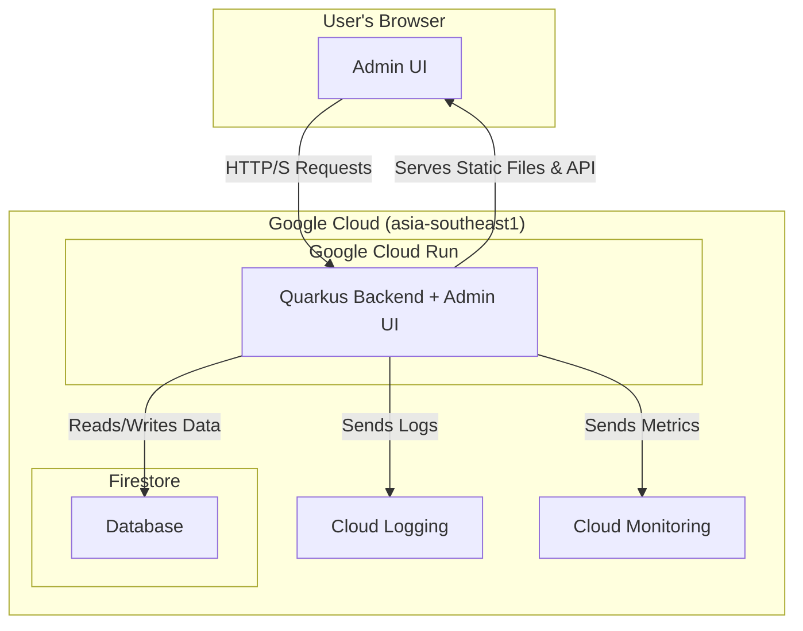

### 2. High Level Architecture (Revised)

#### 2.1. Technical Summary

The proposed architecture for the Saijo Denki power meter system is a full-stack application deployed as a single, cohesive unit on Google Cloud Run. The backend will be built with Quarkus, providing a REST API for data operations, while the frontend will be a responsive React application for administration and data visualization. The React application will be served as static assets directly by the Quarkus backend, which also handles all communication with the Firestore database. This streamlined, serverless approach is designed to meet the PRD's goals for a unified, maintainable, and scalable platform.

#### 2.2. Platform and Infrastructure Choice

**Platform:** Google Cloud
**Key Services:** Google Cloud Run, Firestore, Google Cloud Logging, Google Cloud Monitoring
**Deployment Host and Regions:** `asia-southeast1` (Bangkok)

#### 2.3. Repository Structure

**Structure:** Standard Quarkus Project
**Frontend Location:** The React application will be located in the `src/main/frontend` directory within the Quarkus project.

#### 2.4. High Level Architecture Diagram

#### 2.5. Architectural Patterns

* **Serverless Architecture:** We will use Google Cloud Run to deploy the application in a serverless manner.
  * *Rationale:* This aligns with NFR1 and NFR5, providing automatic scaling, reducing infrastructure management overhead, and allowing us to pay only for what we use.
* **Component-Based UI:** The React frontend will be built using reusable components.
  * *Rationale:* This promotes maintainability, reusability, and a consistent user experience, as outlined in the front-end specification.
* **Repository Pattern:** The Quarkus backend will use the repository pattern to abstract data access logic from the Firestore database.
  * *Rationale:* This decouples the business logic from the data store, making the application easier to test, maintain, and potentially migrate to a different database in the future.
