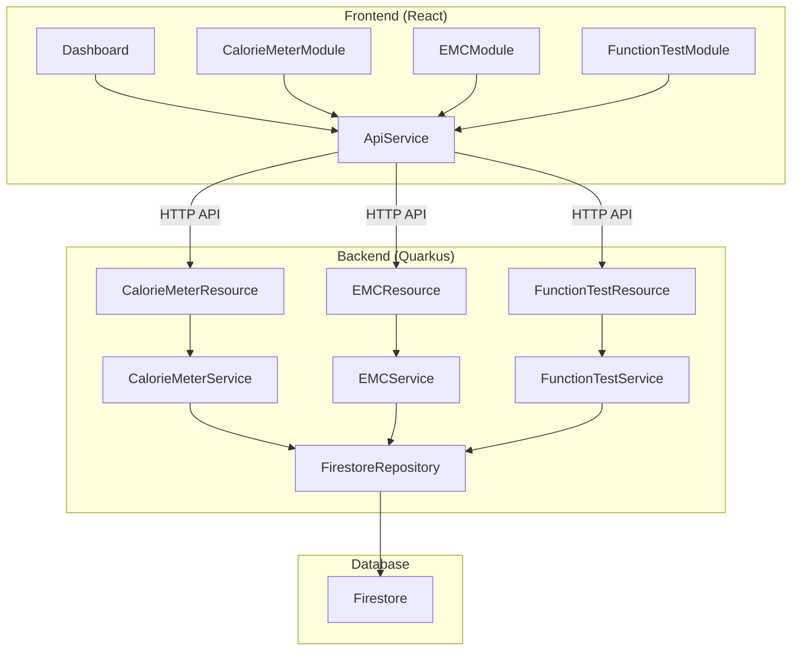

### 6. Components

#### 6.1. Component List

**Frontend Components**

* **Dashboard**
* **CalorieMeterModule**
* **EMCModule**
* **FunctionTestModule**
* **ApiService**

**Backend Components**

* **CalorieMeterResource**
* **EMCResource**
* **FunctionTestResource**
* **CalorieMeterService**
* **EMCService**
* **FunctionTestService**
* **FirestoreRepository**

#### 6.2. Component Diagram

