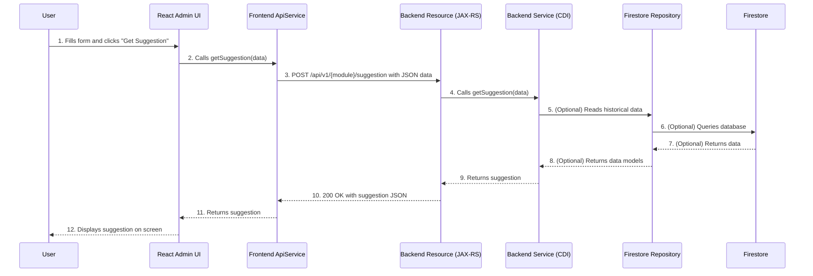
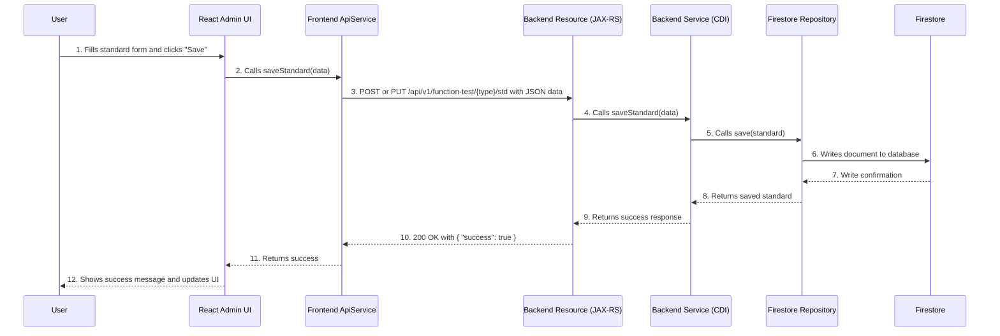

### 8. Core Workflows

#### 8.1. Get Suggestion Workflow (Calorie Meter / EMC)

```mermaid
sequenceDiagram
    participant User
    participant AdminUI as React Admin UI
    participant ApiService as Frontend ApiService
    participant BackendResource as Backend Resource (JAX-RS)
    participant BackendService as Backend Service (CDI)
    participant FirestoreRepo as Firestore Repository
    participant Firestore

    User->>AdminUI: 1. Fills form and clicks "Get Suggestion"
    AdminUI->>ApiService: 2. Calls getSuggestion(data)
    ApiService->>BackendResource: 3. POST /api/v1/{module}/suggestion with JSON data
    BackendResource->>BackendService: 4. Calls getSuggestion(data)
    BackendService->>FirestoreRepo: 5. (Optional) Reads historical data
    FirestoreRepo->>Firestore: 6. (Optional) Queries database
    Firestore-->>FirestoreRepo: 7. (Optional) Returns data
    FirestoreRepo-->>BackendService: 8. (Optional) Returns data models
    BackendService-->>BackendResource: 9. Returns suggestion
    BackendResource-->>ApiService: 10. 200 OK with suggestion JSON
    ApiService-->>AdminUI: 11. Returns suggestion
    AdminUI-->>User: 12. Displays suggestion on screen
```

#### 8.2. Manage Function Test Standards Workflow (Create/Update)

```mermaid
sequenceDiagram
    participant User
    participant AdminUI as React Admin UI
    participant ApiService as Frontend ApiService
    participant BackendResource as Backend Resource (JAX-RS)
    participant BackendService as Backend Service (CDI)
    participant FirestoreRepo as Firestore Repository
    participant Firestore

    User->>AdminUI: 1. Fills standard form and clicks "Save"
    AdminUI->>ApiService: 2. Calls saveStandard(data)
    ApiService->>BackendResource: 3. POST or PUT /api/v1/function-test/{type}/std with JSON data
    BackendResource->>BackendService: 4. Calls saveStandard(data)
    BackendService->>FirestoreRepo: 5. Calls save(standard)
    FirestoreRepo->>Firestore: 6. Writes document to database
    Firestore-->>FirestoreRepo: 7. Write confirmation
    FirestoreRepo-->>BackendService: 8. Returns saved standard
    BackendService-->>BackendResource: 9. Returns success response
    BackendResource-->>ApiService: 10. 200 OK with { "success": true }
    ApiService-->>AdminUI: 11. Returns success
    AdminUI-->>User: 12. Shows success message and updates UI
```
