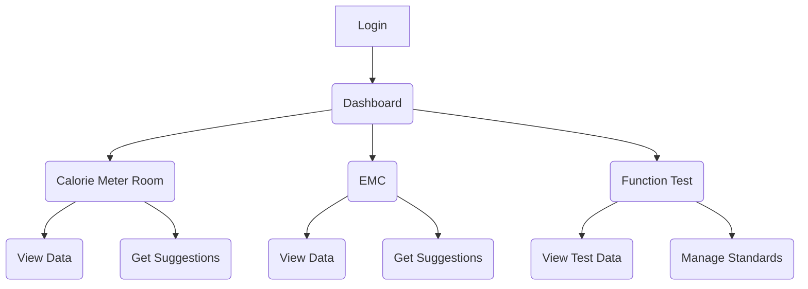

# Saijo Denki Backend for power meter UI/UX Specification

## Introduction

This document defines the user experience goals, information architecture, user flows, and visual design specifications for the Saijo Denki Backend for power meter's user interface. It serves as the foundation for visual design and frontend development, ensuring a cohesive and user-centered experience.

## Overall UX Goals & Principles

### Target User Personas

*   **Factory Operators/Technicians**: These users need a simple and efficient way to monitor the testing modules and input data. They are not necessarily tech-savvy and require a clear and intuitive interface.
*   **Engineers/Managers**: These users need to be able to view and analyze the collected data to make informed decisions. They require a more detailed view of the data and the ability to manage test standards.

### Usability Goals

*   **Ease of learning**: New users should be able to learn how to use the application within a short amount of time.
*   **Efficiency of use**: Frequent users should be able to complete their tasks quickly and with minimal effort.
*   **Error prevention**: The system should be designed to prevent users from making common errors.
*   **Clarity**: The information should be presented in a clear and understandable way.

### Design Principles

1.  **Simplicity**: The UI should be simple and easy to use, even for non-technical users.
2.  **Clarity**: The information should be presented in a clear and concise manner, with a focus on data visualization.
3.  **Consistency**: The UI should be consistent across all modules, with a common layout and navigation structure.
4.  **Efficiency**: The UI should be designed to help users complete their tasks as quickly and efficiently as possible.
5.  **Accessibility**: The UI should be accessible to all users, regardless of their abilities.

## Information Architecture (IA)

### Site Map / Screen Inventory



### Navigation Structure

*   **Primary Navigation**: A sidebar with links to the Dashboard, Calorie Meter Room, EMC, and Function Test modules.
*   **Secondary Navigation**: Within each module, there will be tabs or sub-menus for different views (e.g., "View Data", "Get Suggestions" for the Calorie Meter Room).
*   **Breadcrumb Strategy**: We will use breadcrumbs to show the user their current location in the application (e.g., `Home > Function Test > Manage Standards`).

## User Flows

### View and manage Function Test data and standards

*   **User Goal**: To view the test data from the Function Test module and to manage the test standards.
*   **Entry Points**: From the main dashboard, the user clicks on the "Function Test" module.
*   **Success Criteria**: The user is able to view the test data in a table, filter and sort the data, and add, edit, and delete test standards.

#### Flow Diagram

```mermaid
graph TD
    A[Start] --> B{User clicks on "Function Test" module}
    B --> C{Display Function Test view}
    C --> D{User wants to view test data}
    C --> E{User wants to manage standards}
    D --> F[Display test data in a table]
    F --> G{User filters/sorts data}
    G --> F
    E --> H[Display test standards]
    H --> I{User adds a new standard}
    H --> J{User edits an existing standard}
    H --> K{User deletes a standard}
    I --> L[Show "Add Standard" form]
    J --> M[Show "Edit Standard" form]
    K --> N[Show confirmation dialog]
    L --> H
    M --> H
    N --> H
```

#### Edge Cases & Error Handling:

*   What happens if the backend API is not available? -> Show an error message to the user.
*   What happens if the user enters invalid data in the forms? -> Show validation errors to the user.
*   What happens if the user tries to delete a standard that is currently in use? -> Show a warning message to the user.

#### Notes:

This is a high-level flow. The actual implementation will have more detailed steps and interactions.

### Get suggestions for the Calorie Meter Room

*   **User Goal**: To get suggestions for the Calorie Meter Room based on the test results.
*   **Entry Points**: From the Calorie Meter Room view, the user clicks on the "Get Suggestions" button.
*   **Success Criteria**: The user is able to input the required data, get suggestions from the system, and view the suggestions on the screen.

#### Flow Diagram

```mermaid
graph TD
    A[Start] --> B{User clicks on "Get Suggestions" button}
    B --> C{Display "Get Suggestions" form}
    C --> D{User fills in the form with test data}
    D --> E{User clicks on "Submit" button}
    E --> F{Send data to the backend API}
    F --> G{API returns suggestions}
    G --> H{Display suggestions to the user}
```

#### Edge Cases & Error Handling:

*   What happens if the backend API is not available? -> Show an error message to the user.
*   What happens if the user enters invalid data in the form? -> Show validation errors to the user.
*   What happens if the API returns an error? -> Show a user-friendly error message.

#### Notes:

The form will contain all the fields required by the `getSuggestion` API for the Calorie Meter Room.

## Wireframes & Mockups

*   **Primary Design Files**: We will use Figma for creating the detailed visual designs and prototypes. The designs will be available at a shared Figma link, which will be added here once it's created.

## Component Library / Design System

*   **Design System Approach**: We will use an existing, well-supported component library to build the UI. This will save time and ensure a consistent and high-quality look and feel. I recommend using **Material-UI (MUI)**, as it is a popular and comprehensive React component library that follows the Material Design guidelines.

*   **Core Components**: We will use the following core components from Material-UI:
    *   **Button**: For all buttons in the application.
    *   **Table**: For displaying tabular data.
    *   **TextField**: for all text input fields.
    *   **Select**: For dropdown menus.
    *   **Checkbox**: For checkboxes.
    *   **Dialog**: For confirmation dialogs and modals.
    *   **AppBar**: For the main header of the application.
    *   **Drawer**: For the sidebar navigation.
    *   **Card**: For displaying data in a card format on the dashboard.
    *   **Typography**: For all text elements.

## Branding & Style Guide

*   **Visual Identity**: We will use the official Saijo Denki brand guidelines. If a formal style guide is not available, we will need to work with the marketing team to define one. For now, we will use the Saijo Denki logo and a color palette that is consistent with the company's branding.

*   **Color Palette**:
    *   **Primary**: #004E98 (Blue)
    *   **Secondary**: #FFFFFF (White)
    *   **Accent**: #FDB913 (Yellow)
    *   **Success**: #4CAF50 (Green)
    *   **Warning**: #FFC107 (Amber)
    *   **Error**: #F44336 (Red)
    *   **Neutral**: #F5F5F5 (Light Gray) for backgrounds, #212121 (Dark Gray) for text.

*   **Typography**:
    *   **Font Families**: We will use a clean and modern sans-serif font like **Roboto** for all text in the application.
    *   **Type Scale**: We will define a type scale with different sizes for headings, body text, and other elements to ensure a consistent and hierarchical visual structure.

*   **Iconography**:
    *   **Icon Library**: We will use a consistent set of icons from a library like **Material Icons**.
    *   **Usage Guidelines**: Icons should be used to enhance usability and provide visual cues, but not as the sole means of conveying information.

*   **Spacing & Layout**:
    *   **Grid System**: We will use a responsive grid system (e.g., a 12-column grid) to ensure a consistent and organized layout across all screen sizes.
    *   **Spacing Scale**: We will use a consistent spacing scale (e.g., based on a 4px or 8px grid) for all margins, paddings, and other spacing to ensure a harmonious and balanced design.

## Accessibility Requirements

*   **Compliance Target**: We will aim for **WCAG 2.1 Level AA** compliance. This is a globally recognized standard for web accessibility and will ensure that the application is usable by people with a wide range of disabilities.

*   **Key Requirements**:
    *   **Visual**:
        *   **Color contrast**: All text and important UI elements will have a color contrast ratio of at least 4.5:1 against their background.
        *   **Focus indicators**: All interactive elements will have a clearly visible focus indicator when they are selected using a keyboard.
        *   **Text sizing**: Users will be able to resize the text up to 200% without loss of content or functionality.
    *   **Interaction**:
        *   **Keyboard navigation**: All functionality will be operable through a keyboard interface.
        *   **Screen reader support**: The application will be tested with popular screen readers like NVDA and VoiceOver to ensure that all content and functionality is accessible to screen reader users.
        *   **Touch targets**: All touch targets will be at least 44x44 pixels in size to ensure that they can be easily activated by users with motor impairments.
    *   **Content**:
        *   **Alternative text**: All images will have descriptive alternative text.
        *   **Heading structure**: The application will use a logical heading structure to help users understand the organization of the content.
        *   **Form labels**: All form fields will have clear and descriptive labels.

*   **Testing Strategy**: We will use a combination of automated and manual testing to ensure that the application meets the accessibility requirements.
    *   **Automated testing**: We will use a tool like Axe to automatically scan the application for accessibility issues.
    *   **Manual testing**: We will perform manual testing with a keyboard and screen reader to identify issues that cannot be caught by automated tools.

## Responsiveness Strategy

*   **Breakpoints**: We will use the standard Material-UI breakpoints:
    *   **xs (extra-small)**: 0px
    *   **sm (small)**: 600px
    *   **md (medium)**: 900px
    *   **lg (large)**: 1200px
    *   **xl (extra-large)**: 1536px

*   **Adaptation Patterns**:
    *   **Layout Changes**: The layout will adapt to different screen sizes. On smaller screens, the sidebar navigation may be hidden by default and can be opened with a menu button. The number of columns in the grid will also adapt to the screen size.
    *   **Navigation Changes**: On smaller screens, the primary navigation will be a collapsible drawer instead of a persistent sidebar.
    *   **Content Priority**: On smaller screens, we will prioritize the most important content and hide or collapse less important content.
    *   **Interaction Changes**: On touch devices, we will ensure that all interactive elements have a large enough touch target.

## Animation & Micro-interactions

*   **Motion Principles**:
    *   **Purposeful**: All animations should have a clear purpose, such as providing feedback, guiding the user's attention, or improving the perceived performance of the application.
    *   **Subtle**: Animations should be subtle and not distracting.
    *   **Performant**: Animations should be smooth and performant, even on less powerful devices.

*   **Key Animations**:
    *   **Page transitions**: We will use simple fade-in and fade-out animations for page transitions to create a smooth and seamless experience.
    *   **Button clicks**: Buttons will have a subtle ripple effect on click to provide feedback to the user.
    *   **Loading indicators**: We will use loading indicators (e.g., spinners) to indicate when data is being loaded from the backend.
    *   **Form field focus**: When a form field is focused, it will have a subtle animation to draw the user's attention to it.

## Performance Considerations

*   **Performance Goals**:
    *   **Page Load**: The initial page load time should be under 3 seconds on a fast 3G network.
    *   **Interaction Response**: The UI should respond to user interactions within 100ms.
    *   **Animation FPS**: All animations should run at a smooth 60 frames per second.

*   **Design Strategies**:
    *   **Image Optimization**: All images will be optimized for the web to reduce their file size.
    *   **Code Splitting**: We will use code splitting to only load the JavaScript code that is needed for the current view.
    *   **Lazy Loading**: We will use lazy loading for images and other assets that are not visible on the initial page load.
    *   **Virtualization**: For long lists of data, we will use virtualization to only render the items that are currently visible in the viewport.

## Next Steps

*   **Immediate Actions**:
    1.  **Review with stakeholders**: The UI/UX specification should be reviewed with all stakeholders, including the product manager, developers, and factory personnel, to ensure that it meets the project requirements.
    2.  **Create visual designs**: Based on this specification, the next step is to create high-fidelity visual designs and prototypes in Figma.
    3.  **Prepare for handoff to architect**: Once the visual designs are approved, the project will be ready for the architect to define the front-end architecture.

*   **Design Handoff Checklist**:
    *   [x] All user flows documented
    *   [x] Component inventory complete
    *   [x] Accessibility requirements defined
    *   [x] Responsive strategy clear
    *   [x] Brand guidelines incorporated
    *   [x] Performance goals established

*   **Open Questions**:
    *   Are there any existing brand guidelines or style guides that we should use?
    *   Are there any specific requirements for the suggestion logic in the Calorie Meter Room and EMC modules?